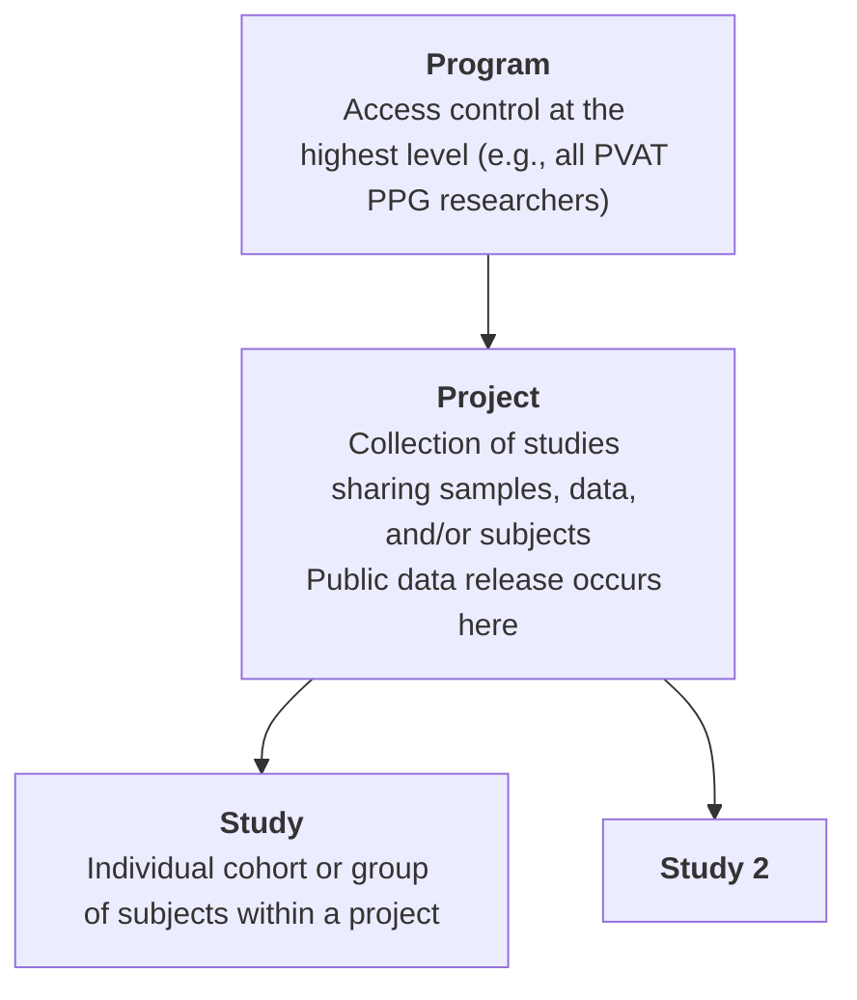

# Data Submission Walkthrough

_This walkthrough guides you through the process of preparing and submitting data to the PVAT PPG Commons._

<i>Use this walkthrough to submit to the following data files nodes:
- Weight Measurements
- Cardiovascular Measurements
- Clinical Chemistry
- Aligned Reads
- Unaligned Reads
- Unaligned Read QC
- Analyzed Data
- Slide Imaging Data
- Mass Spectrometry Raw Data
- Mass Spectrometry Processed Data
- Flow Cytometry Raw Data
- Flow Cytometry Processed Data

To submit to other nodes, please refer to the [Metadata Node Submission Walkthrough](./metadata_walkthrough.md) for guidance.</i>

---

## ▶️ Overview Video

<!-- Replace with actual video later -->
<iframe width="800" height="450"
src="https://www.youtube.com/embed/VIDEO_ID"
frameborder="0" allowfullscreen></iframe>

---

By the end of this walkthrough, you will:

- organize your data files  
- submit your data files to the PVAT PPG Commons 
- add and link metadata to your submitted data files 

---

## Before you start

The PVAT PPG Commons organizes studies with <b>Projects</b> and <b>Studies</b>. Before starting, you and your team should have been assigned both under which all of your studies will be uploaded.



To request assignment of a project and or study please submit [this form](https://forms.gle/YVq4s6z581GSCeKf8)

### Organize your files

Organize your data into a clear folder structure before starting submission.

<b>Recommended structure:</b>

```text
[Program_name]
└── [Project_name]
    └── [Study_name]
        ├── DataFiles
        └── MetadataFiles
```

- **DataFiles** → raw or processed datasets.
- **MetadataFiles** → SheetMATE templates and manifests. You may not have these files already, you will generate them using <i>sheetMATE</i>.

<b>tip:</b>
    This structure is not required, but it simplifies tracking and submission.

---

### Prepare your data files

A data file is any measurement output that can be linked to a subject or sample.

Common examples include:

- Body weights  
- Metabolomics outputs  
- Imaging data  
- Sequencing data
- ...  

<b>note:</b>
    Each file should correspond to a defined data type (node) in the commons ([see interactive data model](https://dev.pvatppgmsu.com/DD)).

<a href="/pvatppg-commons-docs/assets/downloads/test_project_bodyweights.txt" download class="md-button custom-download-btn">
  Download body weights example (.txt)
</a>
---

<!-- !!! tip "Preferred workflow"
    This page follows the **Dataset First** path.

    The **Metadata First** path is the preferred submission route.  
    To begin there, go to **Step 6** (link to invisible anchor at step 6 here). -->

---

## <b>Step 1</b> — Authenticate Session

In google sheets, after [setting up sheetMATE](../sheetmate/setup.md), click on the <i>Gen3DataCommons</i> menu and choose <i>1. Authenticate Session</i>.
   <p align="left">
     
   </p>

This will open a file upload option where you will drop/upload your [<i>credentials.json</i> file that was obtained ](../sheetmate/setup.md#download-json). <b> You must specify which data commons you are working with and from which the credentials were obtained. Current options are:

- PVAT PPG (Dev/Testing)
</b>

<b>tip:</b>
    Credentials are valid for 30 days.

---

## <b>Step 2</b> — Select Project and Study

Before beginning to upload data files, SheetMATE needs to know which project and study you are working with. 

In sheetMATE, select **Gen3DataCommons → 2. Select Project and Study**  

First, choose your project, then the choose your study and click **Save Selection**.
   <p align="left">
     
   </p>

---

## <b>Step 3</b> — Create a Data Files Sheet

The _Data Files Sheet_ is used to provide the list of data files you would like to upload to a given study. Data files become immediately accessible and can be assigned to subjects and samples later in the process. Each are assigned a persistent identifier that can be shared with others, or can be made discoverable through the [_Exploration_ tab in the Gen3DataCommons](https://dev.pvatppgmsu.com/explorer). 

In sheetMATE, select **Gen3DataCommons → Data files → Create data files sheet**  

<b> Required fields:</b>

| file_name | project | type | submitter_id |
|----------|--------|------|--------------|
| Exact file name including the file extension (i.e. rat_body_weights.txt) | Assigned project | Data node type (dropdown) | Unique file identifier |

!!! Note "File Name"
    The file name <u>must</u> include the file extension. For example:
    - rat_body_weights.txt
    - cool_image.png
    - sequencing_data.fastq.gz

!!! Note "Project"
    The project should be the same as the project id (e.g. PPG_0001)

!!! Note "Submitter ID"
    The submitter_id is a unique name you give your file, it may be equal to the file name.

!!! warning
    The `type` must match a valid data node. Current options are: 
    
    - weight_measurement
    - slide_image
    - flow_data
    - clinical_chemistry
    - cardiovascular_measurement
    - ms_raw_data
    - aligned_read
    - unaligned_read

    <i>This has to be entered manually exactly as they are above. A drop-down menu is being repaired</i>

---

## <b>Step 4</b> — Submit to Data Commons

After you've added all the files you plan to submit to the data commons you can submit them to the data commons using sheetMATE. </b>It is possible to add additional files in the future.</b> 

In sheetMATE, select **Gen3DataCommons → Data files → Upload data files** 

You will be asked to choose the files from your file system. These should have the exact same name as they were entered in the template including the file extension.
   <p align="left">
     
   </p>

Once you hit submit, you will be asked to wait until files have all been uploaded and updated in the data commons. This can take several minutes to hours depending on the file size. Do not close your browser as this is being uploaded.

### <b>Confirming succesful submission</b>

<b>Simple</b>: Navigate to the [PVAT PPG Data Commons Exploration tab](https://dev.pvatppgmsu.com/explorer). From there, select the **Files** tab and use the available filters (such as file type or project) to find your data.

!!! note
    Newly uploaded data does not get updated automatically. Contact your Data Commons team to update the portal.

<b>Advanced</b>: Navigate to [PVAT PPG Data Commons Query tab](https://dev.pvatppgmsu.com/query) and change to "Graph Mode" using the orange button on the right side. 

Replace the text in the GraphiQL box with the follwing query syntax modified for your specific data file. These changes will appear almost immediately
```
# replace "PPG_0001" with your own project id
# replace "weight_measurements" with the type of data you're looking for
{
  project(project_id: "MSUPPG-PPG_0001") {
    project_id
    studies {
      study_title
      weight_measurements {
        id
        file_name
        object_id
        file_size
        md5sum
      }
    }
  }
}
```

Expected result:

```
{
  "data": {
    "project": [
      {
        "project_id": "MSUPPG-PPG_0001",
        "studies": [
          {
            "study_title": "Main",
            "weight_measurements": [
              {   
                "id": "19acf8ba-ccef-4bac-8321-fcd1944ffeb8",
                "file_name": "test_project_bodyweights_202604121224.txt",
                "object_id": "dg.PDC/19acf8ba-ccef-4bac-8321-fcd1944ffeb8",
                "file_size": 717,
                "md5sum": "175506dd86feb9a87ebe4bd8effa2359",
              }
            ]
          }
        ]
      }
    ]
  }
}
```

---

## <b>Step 5</b> — Link metadata to your data files

To link metadata to your data file you need to keep the file GUID for your records. The Data Commons team will send you the GUID for your uploaded data files or, you can access it by querying the data commons as described in <b>Step 4. Confirming successful submission - Advanced</b>.

From the Gen3DataCommons menu, choose the <b>Target Node Option</b> that matches the <b>type</b> in the data manifest file

- use the **GUID** assigned from the file manifest  
- do not manually re-enter file metadata  

Follow the [metadata submission process](./metadata_walkthrough.md) in sheetMATE to link your metadata to the uploaded data files using the GUIDs.

---
<!-- 
### <b>Confirming succesful submission</b>

<b>Simple</b>: Navigate to the [PVAT PPG Data Commons Exploration tab](https://dev.pvatppgmsu.com/explorer). From there, select the **Files** tab and use the available filters (such as file type or project) to find your data.

!!! note
    Newly uploaded data does not get updated automatically. Contact your Data Commons team to update the portal.

<b>Advanced</b>: Navigate to [PVAT PPG Data Commons Query tab](https://dev.pvatppgmsu.com/query) and change to "Graph Mode" using the orange button on the right side. 

Replace the text in the GraphiQL box with the follwing query syntax modified for your specific data file. These changes will appear almost immediately

```
# replace "study_2fd2c2d9b5" with your own study id
# Inquire with the data commons teams for nodes that are further from the study node
{
  study (submitter_id: "study_2fd2c2d9b5") {
    subjects {
      submitter_id
      weight_measurements {
        submitter_id
        file_name
        file_size
        md5sum
      }
    }
  }
}

```
Expected result:

```
{
  "data": {
    "study": [
      {
        "subjects": [
          {
            "submitter_id": "RN_1",
            "weight_measurements": [
              {
                "file_name": "test_project_bodyweights_202604121224.txt",
                "file_size": 717,
                "md5sum": "175506dd86feb9a87ebe4bd8effa2359",
                "submitter_id": "RN_1_weight"
              }
            ]
          }
        ]
      }
    ]
  }
}


``` -->

## <b>Step 6</b> - Repeat

Repeat steps 3-5 until all the relevant data and metadata has been uploaded.