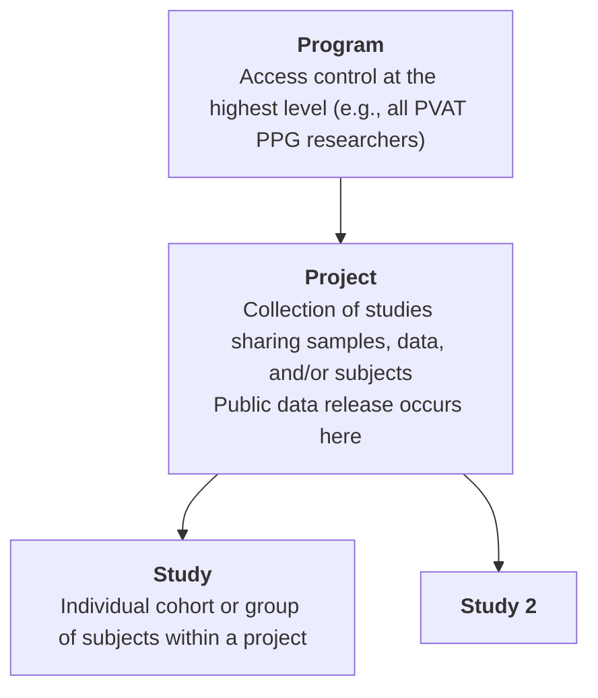
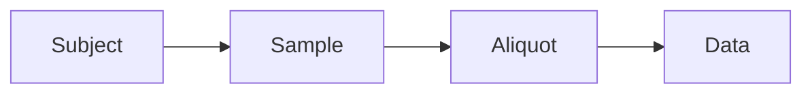

# Metadata Submission Walkthrough

_This walkthrough guides you through the process of preparing and submitting metadata to the PVAT PPG Commons._

---

## ▶️ Overview Video

<!-- Replace with actual video later -->
<iframe width="800" height="450"
src="https://www.youtube.com/embed/VIDEO_ID"
frameborder="0" allowfullscreen></iframe>

---

By the end of this walkthrough, you will:

- organize your metadata files
- populate metadata templates using SheetMATE

---

## Before you start

The PVAT PPG Commons organizes studies with <b>Programs</b> and <b>Projects</b>. Before starting, you and your team should have been assigned both under which all of your studies will be uploaded.



To request assignment of a program and or project please submit [this form](https://forms.gle/YVq4s6z581GSCeKf8)

### Organize your files

Organize your data into a clear folder structure before starting submission.

<b>Recommended structure:</b>

```text
[Program_name]
└── [Project_name]
    └── [Study_name]
        ├── DataFiles
        └── MetadataFiles
```

- **DataFiles** → raw or processed datasets.
- **MetadataFiles** → SheetMATE templates and manifests. You may not have these files already, you will generate them using <i>sheetMATE</i>.

<b>tip:</b>
    This structure is not required, but it simplifies tracking and submission.

---

## <b>Step 1</b> — Authenticate Session

In google sheets, after [installing sheetMATE](../sheetmate/setup.md), click on the <i>Gen3DataCommons</i> menu and choose <i>1. Authenticate Session</i>.
   <p align="left">
     
   </p>

This will open a file upload option where you will drop/upload your [<i>credentials.json</i> file that was obtained ](../sheetmate/setup.md#download-json). <b> You must specify which data commons you are working with and from which the credentials were obtained. Current options are:

- PVAT PPG (Dev/Testing)
</b>

<b>tip:</b>
    Credentials are valid for 30 days.

---

## <b>Step 2</b> — Select Project and Study

Before beginning to upload (meta)data, sheetMATE needs to know which project and study you are working with. 

In sheetMATE, select **Gen3DataCommons → 2. Select Project and Study**  

First, choose your project, then the choose your study and click **Save Selection**.
   <p align="left">
     
   </p>

---

## <b>Step 3</b> — Populate metadata templates 

1. In SheetMATE, select: **Gen3DataCommons → 3. Populate metadata template**

Proceed through templates in order by selecting it in the <b>Select node type</b> menu. Follow the hierarchy from the [data model](https://dev.pvatppgmsu.com/DD) when filling out templates:



!!! note
    Each step builds on the previous one by using shared identifiers. Templates must be completed in the correct order to ensure proper linking ([see recommended order](https://dev.pvatppgmsu.com/DD)).

## <b>Step 4</b> — Submit metadata to the knowledgebase

1. In SheetMATE, select: **Gen3DataCommons → 4. Submit metadata**

Use <b>4. Submit metadata</b> to submit your metadata to the data commons. You can also use <b>Download active sheet</b> to save a local copy for future use. 

### <b>Confirming successful submission</b>

<b>Simple</b>: Navigate to the [PVAT PPG Data Commons Exploration tab](https://dev.pvatppgmsu.com/explorer). From there, select the **Files** tab and use the available filters (such as file type or project) to find your data.

!!! note
    Newly uploaded data does not get updated automatically. Contact your Data Commons team to update the portal.

<b>Advanced</b>: Navigate to [PVAT PPG Data Commons Query tab](https://dev.pvatppgmsu.com/query) and change to "Graph Mode" using the orange button on the right side. 

Replace the text in the GraphiQL box with the following query syntax modified for your specific data file. These changes will appear almost immediately

```
# replace "PPG_0001" with your own project id
# Inquire with the data commons teams for nodes that are further from the study node
{
  project(project_id: "MSUPPG-PPG_0001") {
    project_id
    studies {
      study_title
      subjects {
        submitter_id
      }
    }
  }
}
```
Expected result:

```
{
  "data": {
    "project": [
      {
        "project_id": "MSUPPG-PPG_0001",
        "studies": [
          {
            "study_title": "Main",
            "subjects": []
          }
        ]
      }
    ]
  }
}
```

---

<!-- ## <b>Step 5</b> — Link metadata to your data files

To link metadata to your data file you need to keep the file GUID for your records. The Data Commons team will send you the GUID for your uploaded data files or, you can access it by querying the data commons as described in <b>Step 4. Confirming successful submission - Advanced</b>.

From the Gen3DataCommons menu, choose the <b>Target Node Option</b> that matches the <b>type</b> in the data manifest file

- use the **GUID** assigned from the file manifest  
- do not manually re-enter file metadata  


### <b>Confirming successful submission</b>

<b>Simple</b>: Navigate to the [PVAT PPG Data Commons Exploration tab](https://dev.pvatppgmsu.com/explorer). From there, select the **Files** tab and use the available filters (such as file type or project) to find your data.

!!! note
    Newly uploaded data does not get updated automatically. Contact your Data Commons team to update the portal.

<b>Advanced</b>: Navigate to [PVAT PPG Data Commons Query tab](https://dev.pvatppgmsu.com/query) and change to "Graph Mode" using the orange button on the right side. 

Replace the text in the GraphiQL box with the following query syntax modified for your specific data file. These changes will appear almost immediately

```
# replace "study_2fd2c2d9b5" with your own study id
# Inquire with the data commons teams for nodes that are further from the study node
{
  study (submitter_id: "study_2fd2c2d9b5") {
    subjects {
      submitter_id
      weight_measurements {
        submitter_id
        file_name
        file_size
        md5sum
      }
    }
  }
}

```
Expected result:

```
{
  "data": {
    "study": [
      {
        "subjects": [
          {
            "submitter_id": "RN_1",
            "weight_measurements": [
              {
                "file_name": "test_project_bodyweights_202604121224.txt",
                "file_size": 717,
                "md5sum": "175506dd86feb9a87ebe4bd8effa2359",
                "submitter_id": "RN_1_weight"
              }
            ]
          }
        ]
      }
    ]
  }
}


``` -->

---

## <b>Step 5</b> - Repeat

Continue moving through steps 2 - 4 until all the relevant metadata has been uploaded.