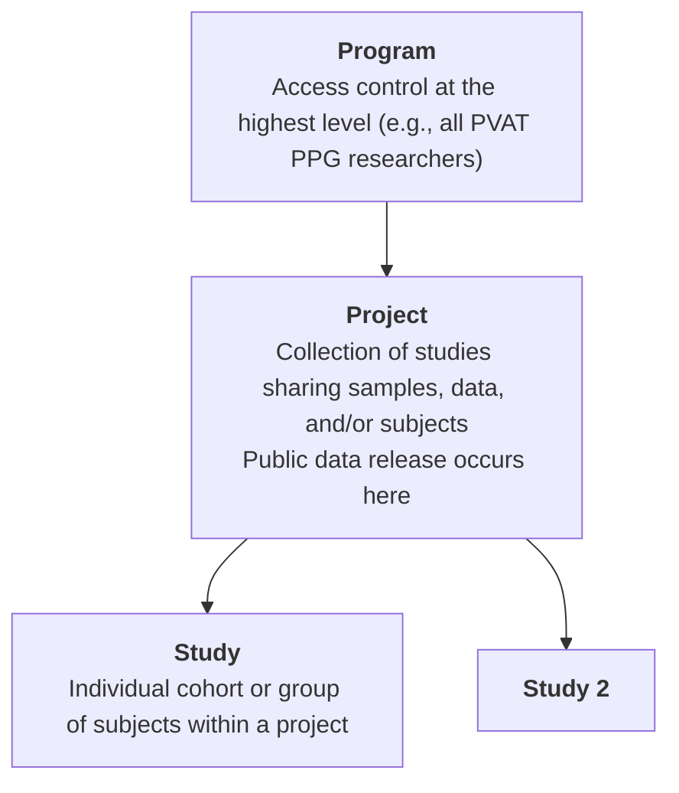
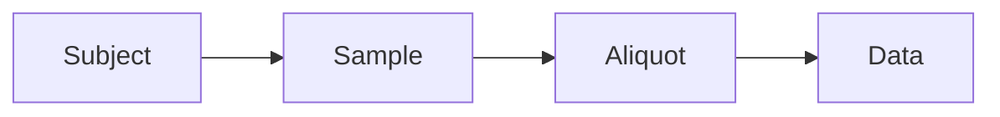

# Data Submission Walkthrough

_This walkthrough guides you through the process of preparing and submitting data to the PVAT PPG Commons._

---

## ▶️ Overview Video

<!-- Replace with actual video later -->
<iframe width="800" height="450"
src="https://www.youtube.com/embed/VIDEO_ID"
frameborder="0" allowfullscreen></iframe>

---

By the end of this walkthrough, you will:

- organize your data files  
- create a data file manifest  
- populate metadata templates using SheetMATE  
- link metadata to your datasets  

---

## Before you start

The PVAT PPG Commons organizes studies with <b>Programs</b> and <b>Projects</b>. Before starting, you and your team should have been assigned both under which all of your studies will be uploaded.



To request assignment of a program and or project please submit [this form](https://google.com)

## Authenticate Session

In google sheets, after [installing sheetMATE](../sheetmate/setup.md), click on the <i>Gen3DataCommons</i> menu and choose <i>1. Authenticate Session</i>.
   <p align="left">
     
   </p>

This will open a file upload option where you will drop/upload your [<i>credentials.json</i> file that was obtained ](../sheetmate/setup.md#download-json). <b> You must specify which data commons you are working with and from which the credentials were obtained. Current options are:

- dev.pvatppgmsu.com
</b>

---

## <b>Step 1</b> — Organize your files

Organize your data into a clear folder structure before starting submission.

<b>Recommended structure:</b>

```text
[Program_name]
└── [Project_name]
    └── [Study_name]
        ├── DataFiles
        └── MetadataFiles
```

- **DataFiles** → raw or processed datasets (see step 2 for preparing your data files).
- **MetadataFiles** → SheetMATE templates and manifests. You may not have these files already, you will generate them using <i>sheetMATE</i>.

<b>tip:</b>
    This structure is not required, but it simplifies tracking and submission.

---

## <b>Step 2</b> — Prepare your data files

A data file is any measurement output that can be linked to a subject or sample.

Common examples include:

- Body weights  
- Metabolomics outputs  
- Imaging data  
- Sequencing data
- ...  

<b>note:</b>
    Each file should correspond to a defined data type (node) in the commons ([see interactive data model](https://dev.pvatppgmsu.com/DD)).

<a href="/pvatppg-commons-docs/assets/downloads/test_project_bodyweights.txt" download class="md-button custom-download-btn">
  Download body weights example (.txt)
</a>
---

!!! tip "Preferred workflow"
    This page follows the **Dataset First** path.

    The **Metadata First** path is the preferred submission route.  
    To begin there, go to **Step 6** (link to invisible anchor at step 6 here).

---

## <b>Step 3</b> — Create or load Study

Before beggining to upload (meta)data, sheetMATE needs to know which study you are working with. You can select one, or create one using sheetMATE. 

In sheetMATE, select **Gen3DataCommons → 2. Populate metadata template**  
   <p align="left">
     
   </p>

Choose your program, project, and study (do not leave any of them blank). The third option (<i>working node</i>) will only be visible after choosing a study. Here you <b>must select study</b>
   <p align="left">
     
   </p>

---

## <b>Step 4</b> — Create a Data File Manifest

The _Data File Manifest_ is used to provide the list of data files you would like to upload to a given study. Data files become immediately accessible and can be assigned to subjects and samples later in the process. Each are assigned a persistent identifier that can be shared with others, or can be made discoverable through the [_Exploration_ tab in the Gen3DataCommons](https://dev.pvatppgmsu.com/explorer). 

In sheetMATE, select **Gen3DataCommons → 3.2. Create Data File Manifest**  

<b> Required fields:</b>

| file_name | project | type | submitter_id |
|----------|--------|------|--------------|
| Exact file name including the file extension (i.e. rat_body_weights.txt) | Assigned project | Data node type (dropdown) | Unique file identifier |

!!! Note File Name Note
    The file name <u>must</u> include the file extension. For example:
    - rat_body_weights.txt
    - cool_image.png
    - sequencing_data.fastq.gz

!!! Note Project Note
    This should be the same project id as in the first column of sheet 1

!!! Note submitter_id Note
    This should be the same submitter id as in the submitter_id column of sheet 1

!!! warning
    The `type` must match a valid data node. Current options are: 
    
    - weight_measurement
    - slide_image
    - flow_data
    - clinical_chemistry
    - cardiovascular_measurement
    - ms_raw_data
    - aligned_read
    - unaligned_read

    <i>This has to be entered manually exactly as they are above. A drop-down menu is being repaired</i>


---

## <b>Step 5</b> — Submit to Data Commons

After you've added all the files you plan to submit to the data commons you can submit them to the data commons using sheetMATE. </b>It is possible to add additional files in the future.</b> 

In sheetMATE, select **Gen3DataCommons → 3.1. Submit to Knowledgebase** 

You will be asked to choose the files from your file system. These should have the exact same name as they were entered in the template including the file extension.
   <p align="left">
     
   </p>

Once you hit submit, you will be asked to wait until files have all been uploaded and updated in the data commons. This can take several minutes to hours depending on the file size. Do not close your browser as this is being uploaded.

### <b>Confirming succesful submission</b>

<b>Simple</b>: Navigate to the [PVAT PPG Data Commons Exploration tab](https://dev.pvatppgmsu.com/explorer). From there, select the **Files** tab and use the available filters (such as file type or project) to find your data.

!!! note
    Newly uploaded data does not get updated automatically. Contact your Data Commons team to update the portal.

<b>Advanced</b>: Navigate to [PVAT PPG Data Commons Query tab](https://dev.pvatppgmsu.com/query) and change to "Graph Mode" using the orange button on the right side. 

Replace the text in the GraphiQL box with the follwing query syntax modified for your specific data file. These changes will appear almost immediately

```
# replace "study_2fd2c2d9b5" with your own study id
# replace "weight_measurements" with the type of data you're looking for
{
  study (submitter_id: "study_2fd2c2d9b5") {
    submitter_id
    weight_measurements {
      file_name
      object_id
    }
  }
}
```
Expected result:

```
{
  "data": {
    "study": [
      {
        "submitter_id": "study_2fd2c2d9b5",
        "weight_measurements": [
          {
            "file_name": "test_project_bodyweights_202604121224.txt",
            "object_id": "dg.PDC/19acf8ba-ccef-4bac-8321-fcd1944ffeb8"
          },
        ]
      }
    ]
  }
}
```


---

## <b>Step 6</b> — Populate metadata templates (preferred starting point)

1. In SheetMATE, select:  
   **Gen3DataCommons → 2. Populate metadata template**

Proceed through templates in order by selecting it in the <b>Target Node Options</b>. Follow the hierarchy from the [data model](https://dev.pvatppgmsu.com/DD) when filling out templates:



!!! note
    Each step builds on the previous one by using shared identifiers. Templates must be completed in the correct order to ensure proper linking ([see recommended order](https://google.com)).

Use <b>3.1. Submit to knowledgebase</b> to submit your metadata to the data commons. You can also use <b>4. Download</b> to save a local copy for future use. 

### <b>Confirming succesful submission</b>

<b>Simple</b>: Navigate to the [PVAT PPG Data Commons Exploration tab](https://dev.pvatppgmsu.com/explorer). From there, select the **Files** tab and use the available filters (such as file type or project) to find your data.

!!! note
    Newly uploaded data does not get updated automatically. Contact your Data Commons team to update the portal.

<b>Advanced</b>: Navigate to [PVAT PPG Data Commons Query tab](https://dev.pvatppgmsu.com/query) and change to "Graph Mode" using the orange button on the right side. 

Replace the text in the GraphiQL box with the follwing query syntax modified for your specific data file. These changes will appear almost immediately

```
# replace "study_2fd2c2d9b5" with your own study id
# Inquire with the data commons teams for nodes that are further from the study node
{
  study (submitter_id: "study_2fd2c2d9b5") {
    submitter_id
		subjects {
      submitter_id
    }
  }
}
```
Expected result:

```
{
  "data": {
    "study": [
      {
        "subjects": [
          {
            "submitter_id": "RN_1"
          },
          {
            "submitter_id": "RN_2"
          },
          {
            "submitter_id": "RN_3"
          },
          {
            "submitter_id": "RN_4"
          },
          {
            "submitter_id": "RN_5"
          },
          {
            "submitter_id": "RN_6"
          }
        ],
        "submitter_id": "study_2fd2c2d9b5"
      }
    ]
  }
}
```

---

## <b>Step 7</b> — Link metadata to your data files

To link metadata to your data file you need to keep the file GUID for your records. See <b>Step 5. Confirming successful submission - Advanced</b> for how to discover your GUID. 

From the Gen3DataCommons menu, choose the <b>Target Node Option</b> that matches the <b>type</b> in the data manifest file

- use the **GUID** assigned from the file manifest  
- do not manually re-enter file metadata  

Use <b>3.1. Submit to knowledgebase</b> to submit your metadata to the data commons. You can also use <b>4. Download</b> to save a local copy for future use. 

### <b>Confirming succesful submission</b>

<b>Simple</b>: Navigate to the [PVAT PPG Data Commons Exploration tab](https://dev.pvatppgmsu.com/explorer). From there, select the **Files** tab and use the available filters (such as file type or project) to find your data.

!!! note
    Newly uploaded data does not get updated automatically. Contact your Data Commons team to update the portal.

<b>Advanced</b>: Navigate to [PVAT PPG Data Commons Query tab](https://dev.pvatppgmsu.com/query) and change to "Graph Mode" using the orange button on the right side. 

Replace the text in the GraphiQL box with the follwing query syntax modified for your specific data file. These changes will appear almost immediately

```
# replace "study_2fd2c2d9b5" with your own study id
# Inquire with the data commons teams for nodes that are further from the study node
{
  study (submitter_id: "study_2fd2c2d9b5") {
    subjects {
      submitter_id
      weight_measurements {
        submitter_id
        file_name
        file_size
        md5sum
      }
    }
  }
}

```
Expected result:

```
{
  "data": {
    "study": [
      {
        "subjects": [
          {
            "submitter_id": "RN_1",
            "weight_measurements": [
              {
                "file_name": "test_project_bodyweights_202604121224.txt",
                "file_size": 717,
                "md5sum": "175506dd86feb9a87ebe4bd8effa2359",
                "submitter_id": "RN_1_weight"
              }
            ]
          }
        ]
      }
    ]
  }
}


```

---

## <b>Step 8</b> - Repeat

Continue moving through steps 6 - 7 until all the relevant metadata has been uploaded