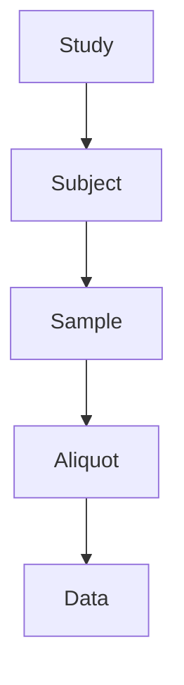

# Data Submission Walkthrough

_This walkthrough guides you through the process of preparing and submitting data to the PVAT PPG Commons._

---

## ▶️ Overview Video

<!-- Replace with actual video later -->
<iframe width="800" height="450"
src="https://www.youtube.com/embed/VIDEO_ID"
frameborder="0" allowfullscreen></iframe>

---

By the end of this walkthrough, you will:

- organize your data files  
- create a data file manifest  
- populate metadata templates using SheetMATE  
- link metadata to your datasets  

---

## Step 1 — Organize your files

Organize your data into a clear folder structure before starting submission.

<b>Recommended structure:</b>

```text
[Program_name]
└── [Project_name]
    └── [Study_name]
        ├── DataFiles
        └── MetadataFiles
```

- **DataFiles** → raw or processed datasets  
- **MetadataFiles** → SheetMATE templates and manifests  

<b>tip:</b>
    This structure is not required, but it simplifies tracking and submission.

---

## Step 2 — Prepare your data files

A data file is any measurement output that can be linked to a subject or sample.

Common examples include:

- Body weights  
- Metabolomics outputs  
- Imaging data  
- Sequencing data
- ...  

<b>note:</b>
    Each file should correspond to a defined data type (node) in the commons ([see interactive data model](https://data.pvatppgmsu.com/DD)).

---

## Step 3 — Create a Data File Manifest

The manifest lists all files you plan to upload.

<b>In SheetMATE:</b>

1. Open SheetMATE  
2. Select: **ToxDataCommons → Create Data File Manifest**  

<b> Required fields:</b>

| file_name | project | type | submitter_id |
|----------|--------|------|--------------|
| Exact file name | Assigned project | Data node type (dropdown) | Unique file identifier |

<b>warning:</b>
    The `type` must match a valid data node (e.g., `weight_measurements`, `slide_image`).

---

## Step 4 — Populate metadata templates

1. In SheetMATE, select:  
   **ToxDataCommons → Populate metadata template**

2. Complete the Study template

3. Proceed through templates in order

Follow the hierarchy when filling out templates:



Each step builds on the previous one by using shared identifiers.

<b>important:</b>
    Templates must be completed in the correct order to ensure proper linking ([see recommended order](https://google.com)).

---

## Step 5 — Link metadata to your data files

When completing the data-specific template:

- use the **GUID** assigned from the file manifest  
- do not manually re-enter file metadata  

!!! note
    The GUID is the key link between your dataset and its metadata.

---

## Step 6 — Review before submission

Before submitting, confirm:

- all required templates are complete  
- identifiers are consistent across sheets  
- file names match the manifest exactly  

!!! warning
    Small inconsistencies (IDs, file names) are the most common source of errors.

---

<b>Next steps</b>

- [Set up SheetMATE](../sheetmate/setup.md)  
- [Learn about the data model](../concepts/data-model.md)  
- [View submission requirements](../submission/file-organization.md)